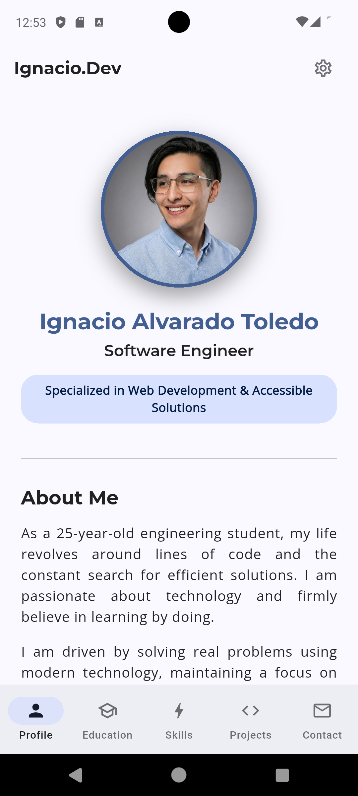
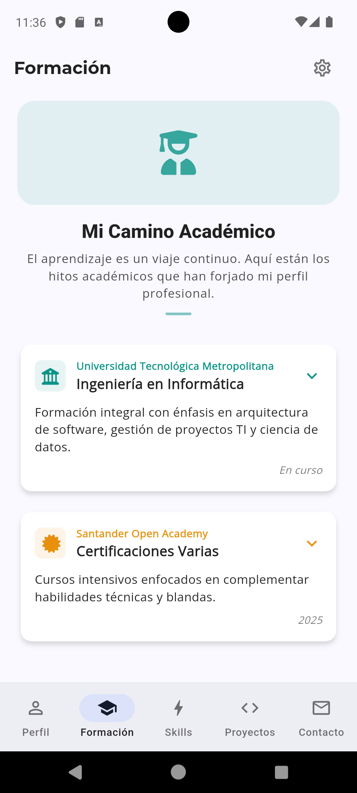
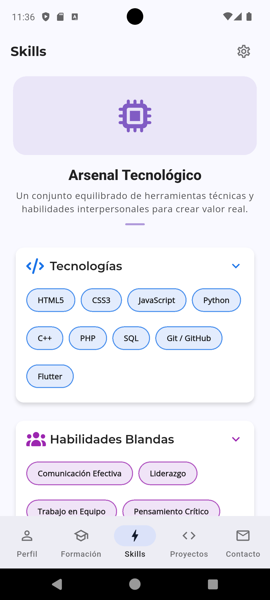
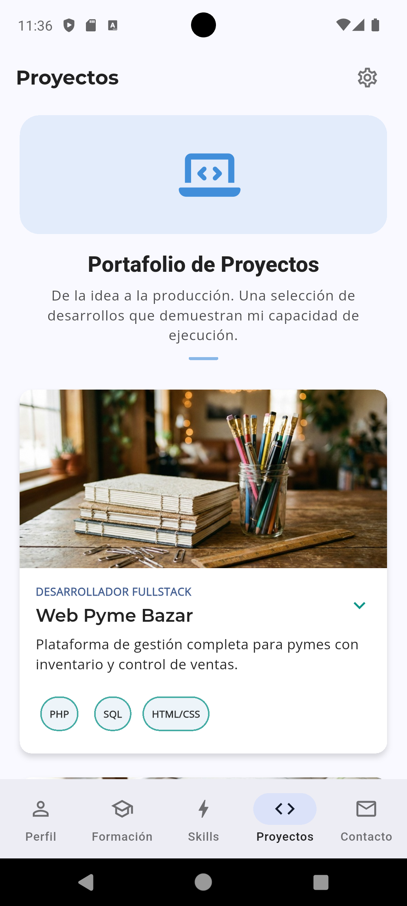
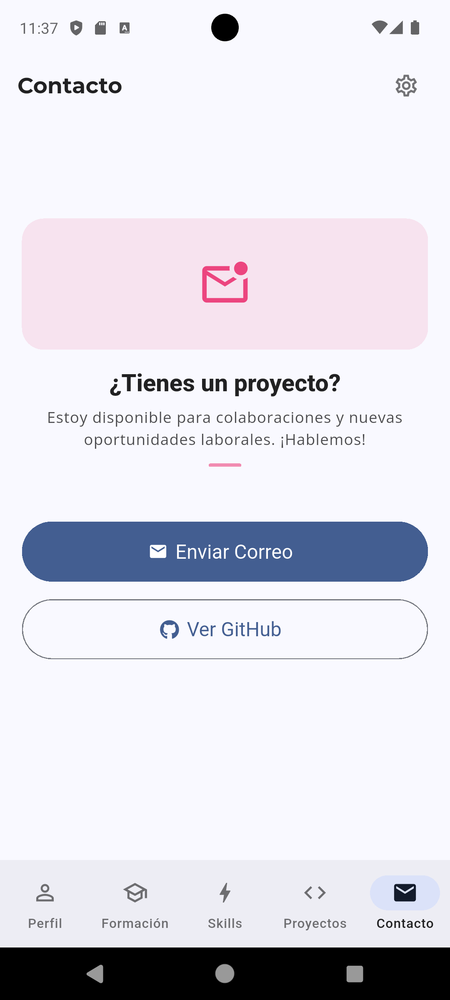
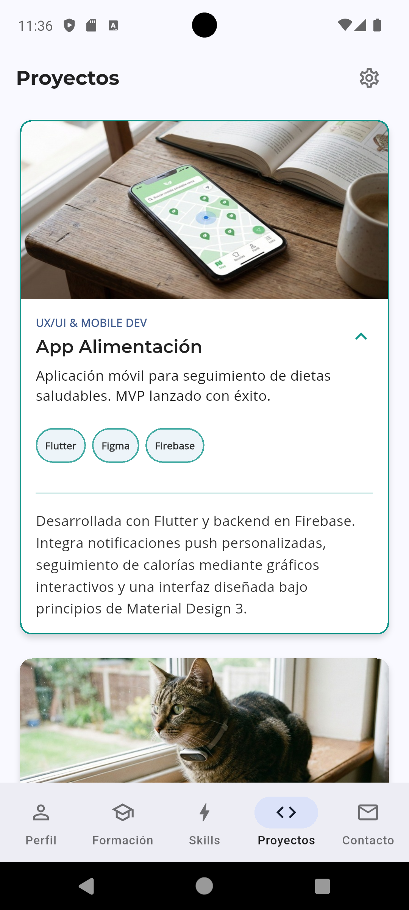
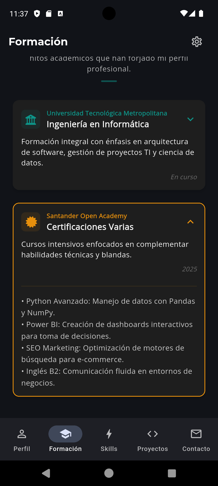
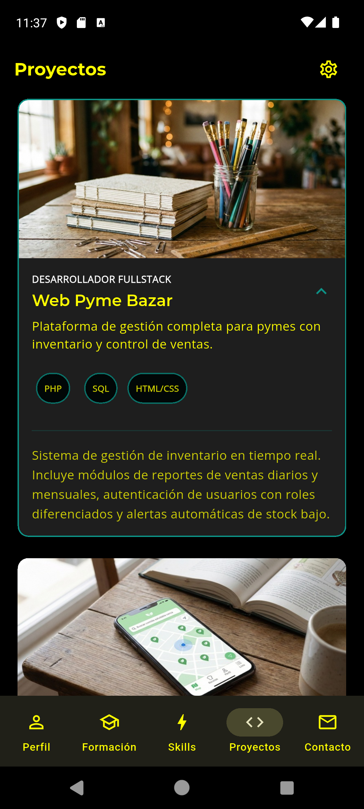
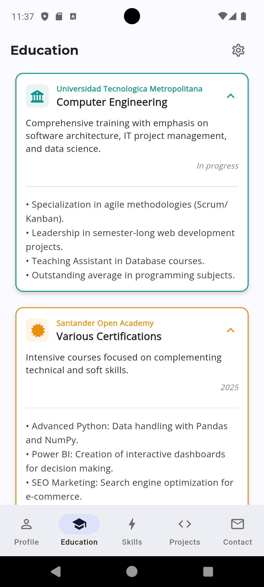

# Portafolio Móvil - Marca Personal (Flutter)

> **Evaluación Recuperativa - Computación Móvil**
>
> **Estudiante:** Ignacio Alvarado Toledo
>
> **Asignatura:** EFE68500 - COMPUTACION MOVIL
>
> **Profesor:** Sebastián Salazar Molina
>
> **Fecha:** 11 de Diciembre 2025
> 
>  **Universidad Tecnológica Metropolitana**


## 📱 Descripción del Proyecto

Este proyecto consiste en el diseño y desarrollo de una aplicación móvil de **Marca Personal**, construida con **Flutter (Dart)**. La aplicación actúa como un portafolio digital interactivo que presenta mi identidad profesional, habilidades, formación académica y proyectos destacados.

A diferencia de un sitio web estático tradicional, esta aplicación aprovecha las capacidades nativas de los dispositivos móviles para ofrecer una experiencia de usuario fluida, animada y accesible, cumpliendo los objetivos propuestos.

---

## 🚀 Características Principales

La aplicación está estructurada en 5 secciones principales, navegables a través de una barra inferior persistente:

1.  **Perfil (Inicio):** Presentación personal con avatar, título profesional y resumen bio ("Sobre mí").
2.  **Formación:** Línea de tiempo interactiva con hitos académicos y certificaciones.
3.  **Skills (Habilidades):** Visualización de competencias técnicas y habilidades blandas mediante tarjetas expandibles.
4.  **Proyectos:** Galería de proyectos destacados (Pyme Bazar, App Alimentación, IoT Mascotas) con detalles técnicos y roles desempeñados.
5.  **Contacto:** Accesos directos para comunicación vía Email y GitHub.

### 🌟 Funcionalidades Destacadas (Bonus)

Además de los requerimientos base, la aplicación incluye características avanzadas:

* **Internacionalización (i18n):** Soporte completo para **Español e Inglés**, cambiable desde la configuración.
* **Temas Dinámicos:** Soporte para **Modo Claro (Light)** y **Modo Oscuro (Dark)**.
* **Accesibilidad Mejorada:**
    * Opción de **Alto Contraste** para mejor visibilidad.
    * Opción de **Reducir Movimiento** para usuarios sensibles a las animaciones.
* **UX Optimizado:** Efectos de desplazamiento nativos ("Bouncing Scroll"), animaciones suaves al expandir tarjetas y retroalimentación visual al tacto.

---

## 🛠️ Tecnologías Utilizadas

* **Framework:** Flutter (SDK v3.x)
* **Lenguaje:** Dart
* **Arquitectura:** Clean Architecture básica con separación de Vistas, Widgets y Modelos.
* **Gestión de Estado:** `ValueNotifier` para preferencias globales (temas, idioma).
* **Paquetes Clave:**
    * `flutter_localizations`: Para soporte multi-idioma.
    * `font_awesome_flutter`: Iconografía profesional.
    * `url_launcher`: Para abrir enlaces externos (GitHub, Mail).
    * `shared_preferences` (Simulado/Preparado): Para persistencia de configuración.

---

## 📸 Galería de Pantallas

A continuación se presenta una vista previa de la aplicación en funcionamiento:

### Vistas Principales
| Perfil | Formación | Skills |
|:---:|:---:|:---:|
|  |  |  |
*(El perfil destaca la identidad visual, mientras que las listas usan tarjetas expandibles)*

### Proyectos y Contacto
| Proyectos | Contacto | Menú de Navegación |
|:---:|:---:|:---:|
|  |  |  |

### Configuración y Accesibilidad
| Modo Oscuro | Alto Contraste | Cambio de Idioma (EN) |
|:---:|:---:|:---:|
|  |  |  |

---

## 🔧 Instrucciones de Instalación y Ejecución

Para visualizar este proyecto en un emulador o dispositivo físico:

1.  **Clonar el repositorio:**
    ```bash
    git clone [https://github.com/iAlvaradoUtem/portafolio_app.git](https://github.com/iAlvaradoUtem/portafolio_app.git)
    cd portafolio_app
    ```

2.  **Instalar dependencias:**
    ```bash
    flutter pub get
    ```

3.  **Ejecutar la aplicación:**
    ```bash
    flutter run
    ```

> **Nota:** Asegúrese de tener configurado un dispositivo Android o un emulador antes de ejecutar el comando.

---

## 📄 Estructura del Proyecto

El código sigue una estructura organizada para facilitar el mantenimiento:

```text
lib/
├── config/          # Temas, Assets y Notificadores de Preferencias
├── l10n/            # Archivos de traducción (app_es.arb, app_en.arb)
├── utils/           # Utilidades (Navegación, Enlaces Externos)
├── views/           # Pantallas principales (Profile, Skills, etc.)
├── widgets/         # Componentes reutilizables (Tarjetas, Layouts)
└── main.dart        # Punto de entrada de la aplicación
```

---

## 👨‍💻 Autor

**Ignacio Alvarado** *Ingeniería en Informática (En formación)* *Universidad Tecnológica Metropolitana*

---
